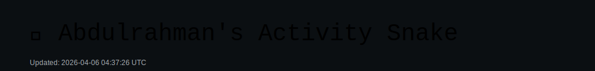

<!-- README.md - Abdulrahman Muhammed Abdelmunim - Dark & Light with Animated Banner -->

<!-- Banner (uses SVG which adapts to dark/light) -->
<p align="center">
  <picture>
    <source media="(prefers-color-scheme: dark)" srcset="assets/banner-dark.svg">
    
  </picture>
</p>

<h1 align="center">Hi, I'm Abdulrahman Muhammed Abdelmunim 👋</h1>
<h3 align="center">.NET Developer • System Administrator • Help Desk Specialist • Healthcare IT & Data Management</h3>

<p align="center">
  <a href="https://www.linkedin.com/in/abdulrahmanmunimx/"></a>
  <a href="mailto:cw_16450321@hotmail.com"></a>
  <a href="mailto:abdulrahman970213@outlook.com"></a>
  <a href="https://github.com/abdulrahman0000123"></a>
</p>

---

## 🚀 About Me
I’m an IT & Software professional with **6+ years** experience in healthcare IT, system administration, .NET development, and tech support. I combine backend development skills with system reliability practices and strong domain knowledge in healthcare information systems.

**Currently:** .NET Developer / Healthcare Licensing & Credentialing Specialist at GAHAR.

**Core:** Windows Server (AD, DNS, DHCP), .NET (Framework/Core), APIs, Databases, Help Desk, Software Testing (CSTE), Automation & AI tools.

---

## 🎯 Highlights & Achievements
- 6+ years in Healthcare IT & Systems  
- Built **Horus Patient ERP** modules used in hospital workflows  
- Certified Software Tester (CSTE) — MCIT Egypt  
- Multiple certifications: ALX AICE (AI), ICDL, Cisco cybersecurity modules

---

## 🧰 Skills

<p align="left">
  
</p>

---

## 💼 Experience (summary)
**.NET Developer — GAHAR**  
- Backend and API development, system optimization, features delivery.

**System Administrator — Egypt Healthcare Authority**  
- Windows Server administration, AD, DNS, DHCP, backups, DR.

**Help Desk Specialist**  
- Tier 1/2 support, ticketing, user training, hardware/software troubleshooting.

---

## 🔧 Projects (Highlighted)
### Horus Patient ERP  
**Tech:** VBA, Excel, Database systems  
- Patient emergency & inpatient records, unified DB, automated reports & ticket printing.  
- Interfaces: Emergency Office / Admission Office / Medical Records.

*(Add more projects below — see "How to add more projects" section.)*

---

## 📊 GitHub Stats & Activity

<p align="center">
  
  
</p>

<p align="center">
  
</p>

---

## 🐍 Animated Snake (auto-updated)
<p align="center">
  
</p>

> The snake SVG is updated daily by a GitHub Action (changes color / timestamp) so the image looks dynamic.

---

## 📂 How to add more Projects / Achievements
Edit this `README.md` and add more project cards under the **Projects** section. Example card:

```md
### Project Name — Short Tagline
**Tech:** .NET, SQL Server, Docker  
- 1–2 bullets describing impact, outcomes, and your role.
